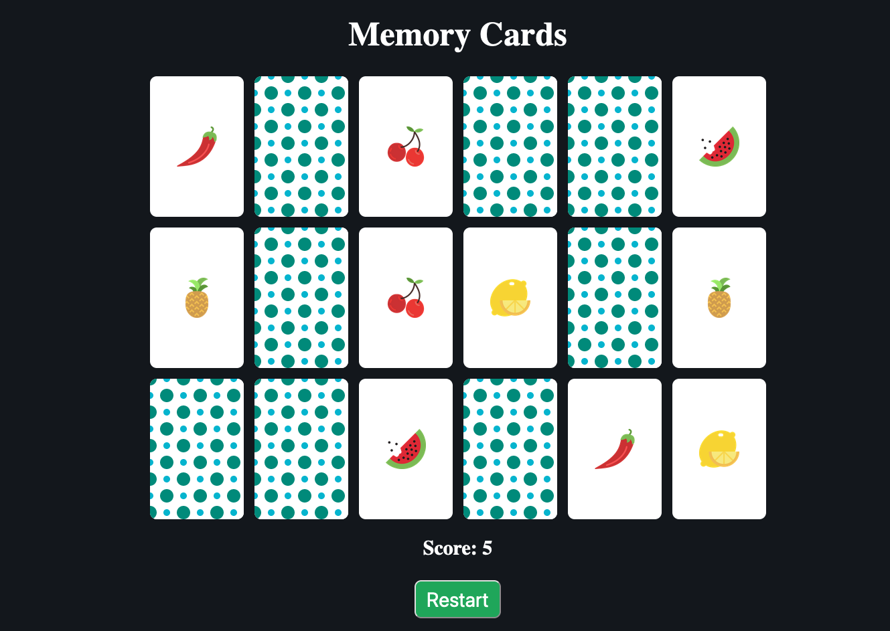

# Project - Memory Card Game
**Memory Card Game** is a JavaScript apllication built using HTML, CSS, and JavaScript. The goal is to score as many points by matching the cards. 

## User Stories

The following **required** functionality is completed: 

* [x] User can **flip cards when clicked**
* [x] User can **restart the game when button is pressed**
* [x] Cards will **remain flipped once they are matched**

## Game Images

The image below shows the start of the game. 

The image below shows the cards staying flipped, onced matched. 

